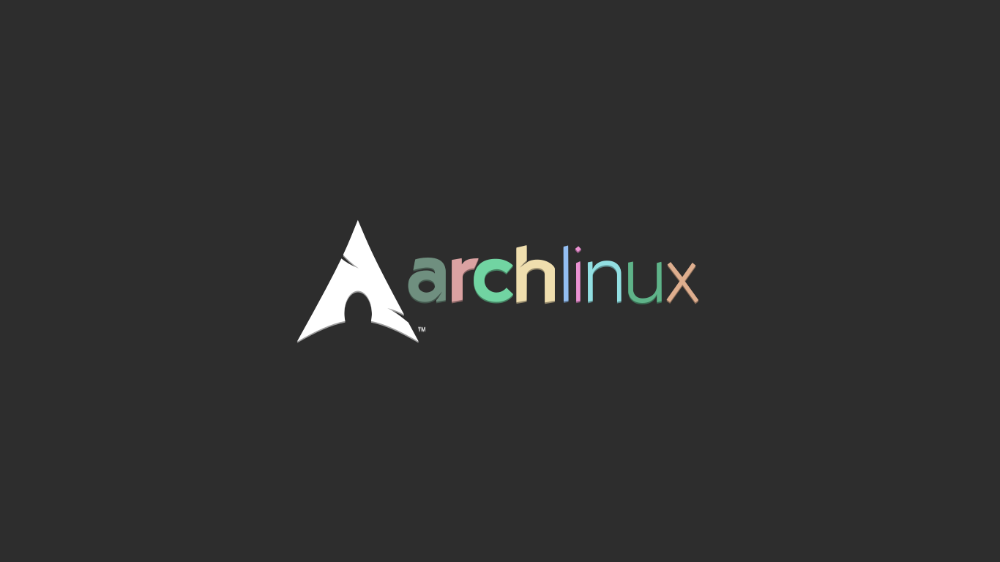
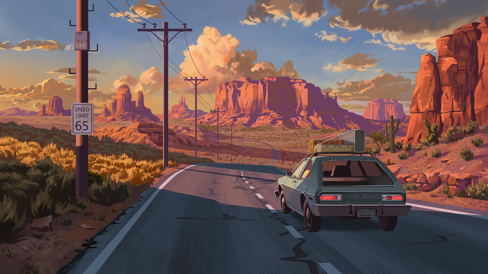
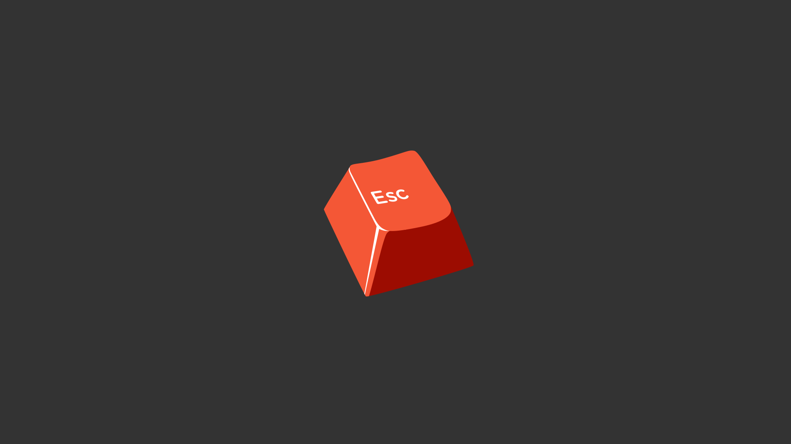
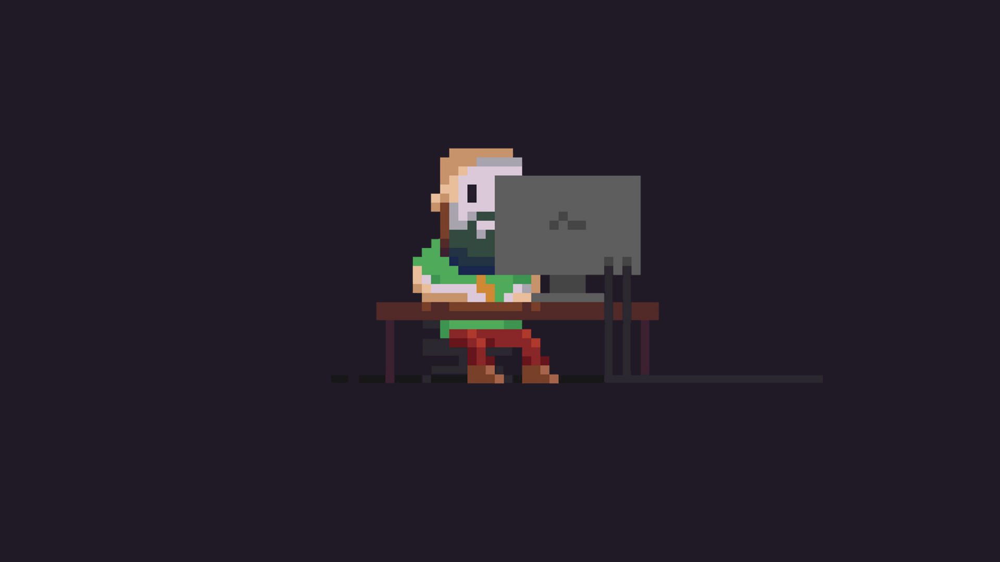
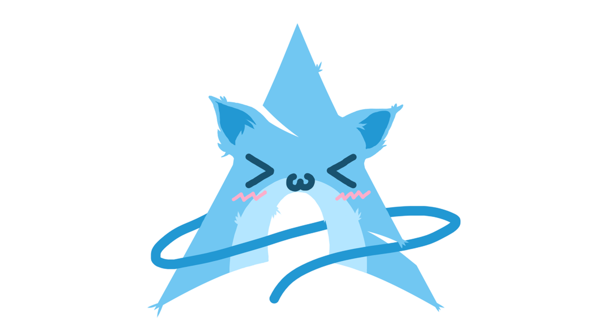
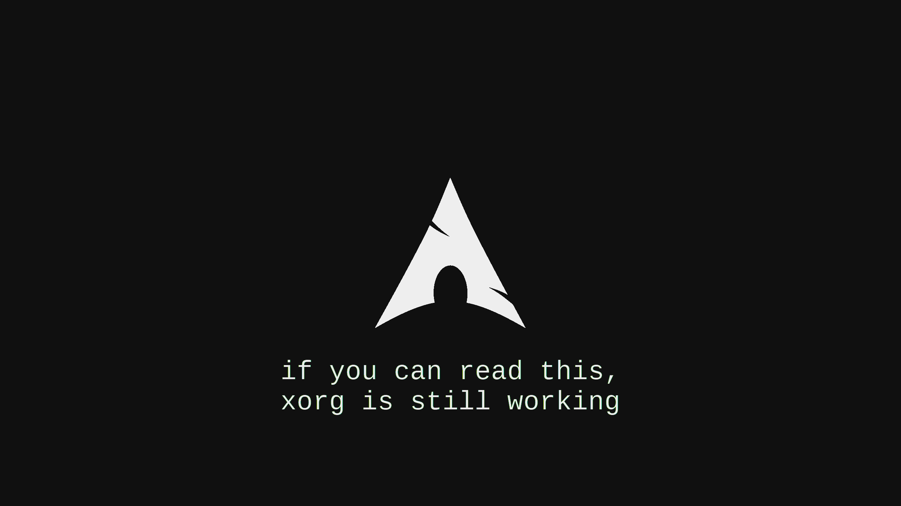

# Wallpapers 

# Configs
|Package|Location|
|---|---|
|mtab|[config.txt](dotfiles/mtab/config.txt)|
|cava|[config](dotfiles/cava/config)

 
# Installation Type

 |Installation Type|Packages|
 |---|:---:|
 |Full Install|gnome-tweaks brave-browser min firefox cava cmatrix code git npm nano vim make python qemu-full virt-manager anydesk zed zen|
 |Minimal Install|brave-broser firefox nano code|
 |Coding Workspace|code git nano vim make qemu-full virt-manager npm firefox|
 

